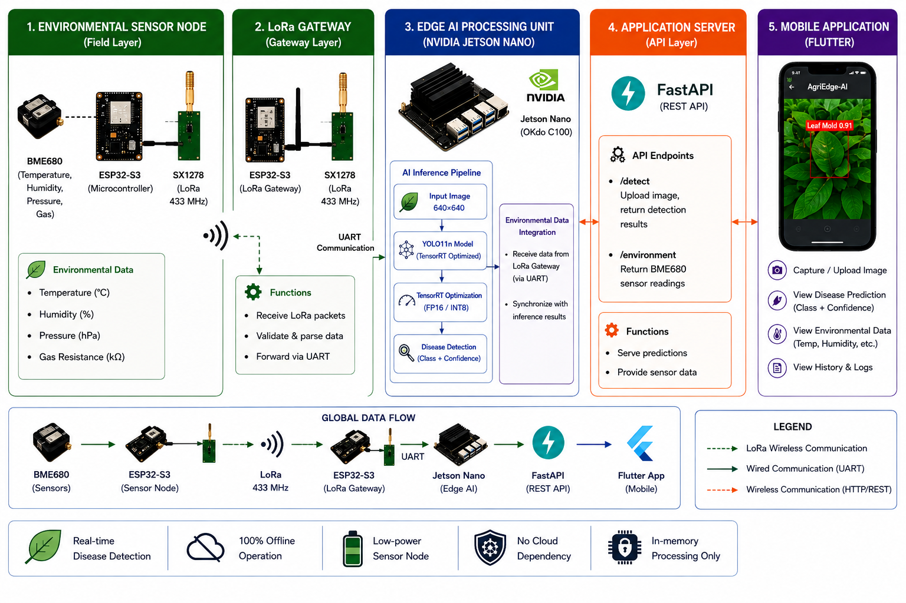

# 🌱 AgriEdge-AI

**A complete, fully offline Edge AI + IoT system for multi-crop plant disease detection.**

AgriEdge-AI combines computer vision, embedded deployment, wireless IoT sensing, and mobile application development into a single validated end-to-end system — designed to run entirely without cloud dependency, for use in connectivity-constrained agricultural regions.

> 🎓 Developed as part of an R&D internship at ESPRIT (Tunisia).

---

## 🚀 What it does

1. A **BME680 environmental sensor** (temperature, humidity, pressure, gas resistance) attached to an **ESP32-S3** reads real-time field data.
2. Data is transmitted wirelessly via **LoRa (SX1278, 433 MHz)** to a gateway node.
3. The gateway relays data over **UART** to an **NVIDIA Jetson Nano**.
4. A user photographs a plant leaf via the **mobile app**; the image is sent to a **FastAPI** server running on the Jetson.
5. **YOLO11n**, optimized with **TensorRT (FP16)**, detects the disease in **235 ms**.
6. The diagnosis, enriched with live environmental context, is returned and displayed on the mobile app.

---

## 🏗️ System Architecture

---

## 📊 Key Results

| Component | Result |
|---|---|
| Dataset | 47,813 images, 24 disease, pest, and stress classes, fused from 9 public sources |
| Best model | YOLO11n, mAP50 = 0.659 (2.6M params), computed on the validation split |
| Edge inference (Jetson Nano, TensorRT FP16, 640x640, retained configuration) | 21.84 FPS, 45.78 ms |
| Edge inference (416x416, throughput-oriented variant) | 31 FPS |
| LoRa link | RSSI: -74 to -76 dBm at short range (laboratory conditions) |
| End-to-end API response (image + sensor data) | 235.8 ms (representative test) |
| Mobile app | Tested end-to-end on physical Android device |

Three exploratory architectures were also evaluated and transparently reported:
- **Two-stage detect-then-classify pipeline** (YOLO11n + EfficientNet-B0 classifier): 96.99% classification accuracy, ~14 FPS combined
- **AgriYOLO** (YOLO11n + EfficientNet-B0 dual-backbone fusion): mAP50 = 0.486 (negative result, analyzed)
- **YOLO11n_Opt** (scale-reduced variant, 1.5M params): mAP50 = 0.570, up to 50 FPS at 416x416

---

## 🛠️ Tech Stack

**Vision & ML:** YOLOv8/YOLO11 (Ultralytics), PyTorch, TensorRT, OpenCV, EfficientNet-B0
**Embedded:** NVIDIA Jetson Nano, ESP32-S3, C++ (Arduino/PlatformIO)
**IoT:** LoRa (SX1278), BME680, UART
**Backend:** Python, FastAPI, PyCUDA
**Mobile:** Flutter, Dart
**Hardware Design:** KiCad

---

## 📁 Repository Structure

AgriEdge-AI/
data/ - Dataset fusion and preprocessing scripts
training/ - Model training notebooks (comparative study, AgriYOLO, YOLO11n_Opt)
deployment_jetson/ - TensorRT/pycuda inference, FastAPI server, UART listener, test scripts
esp32/ - ESP32-S3 sensor node and LoRa gateway firmware
mobile_app/ - Flutter application (agri_ai_app)
models/ - Final ONNX export (YOLO11n, 640x640)
docs/figures/ - Report and article figures, validation captures, KiCad schematics
notebooks/ - Dataset exploration notebook

Model training notebooks (comparative study, AgriYOLO, YOLO11n_Opt, EfficientNet classifier) were run on Kaggle; see the internship report for full notebook references.

---

## 📄 Documentation

- 📘 Full internship report (French) and scientific article (MDPI, AgriEngineering) are maintained separately and will be added to this repository at a later stage.

---

## 👤 Author

**Mohamed Raed Boukari** - Engineering Student, ESPRIT (Tunisia)
Supervised by Mme. Oumaima Jouini and Mme. Imen Bouabidi (ESPRIT, Department of Telecommunications)

📫 mohamedraed.boukari@esprit.tn | [LinkedIn](https://linkedin.com/in/medraedboukari)

---

## 📜 License

This project is licensed under the MIT License — see the [LICENSE](LICENSE) file for details.

Datasets used are derived from publicly available sources on Roboflow Universe; license terms should be verified per source before redistribution (see the internship report for details).
